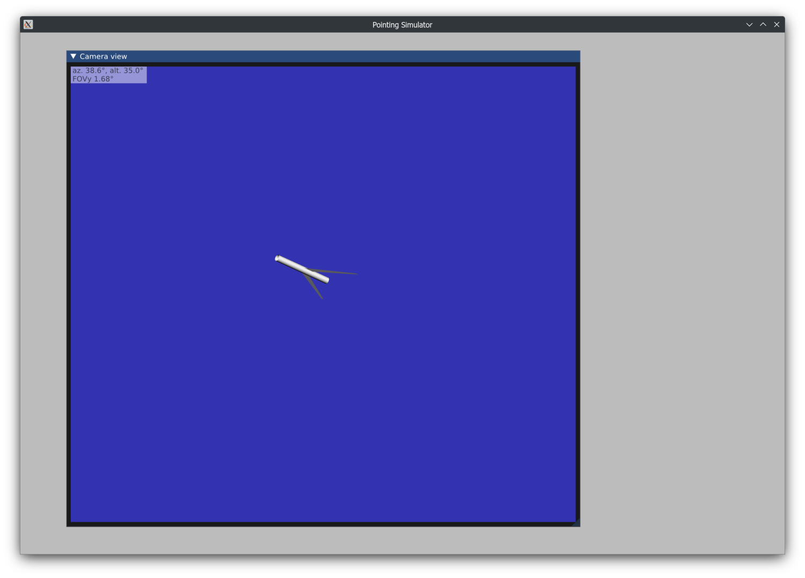

# Pointing Simulator

Copyright (C) 2023-2024 Filip Szczerek (ga.software@yahoo.com)

*This program is licensed under MIT license (see LICENSE.txt for details).*

# Overview

Telescope pointing simulator for testing [TPTool]().

SI units are used for all quantities.
